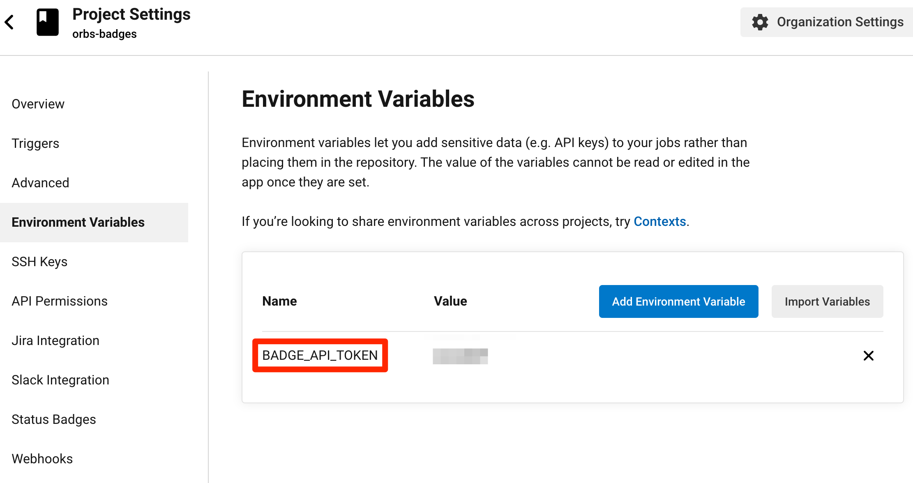
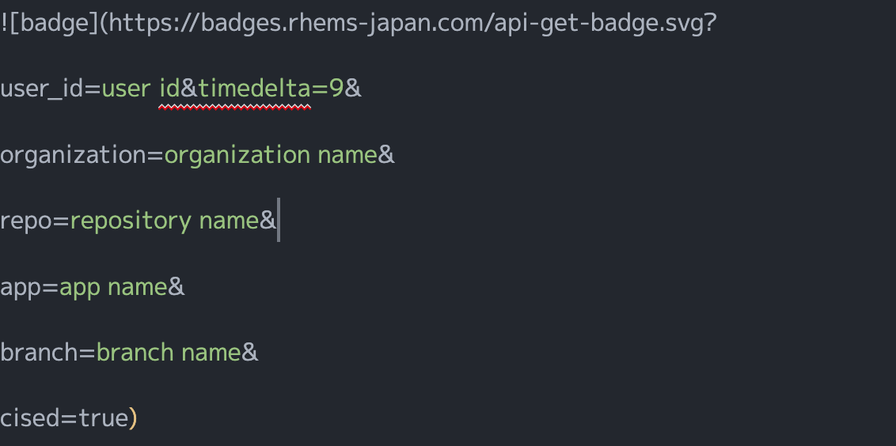
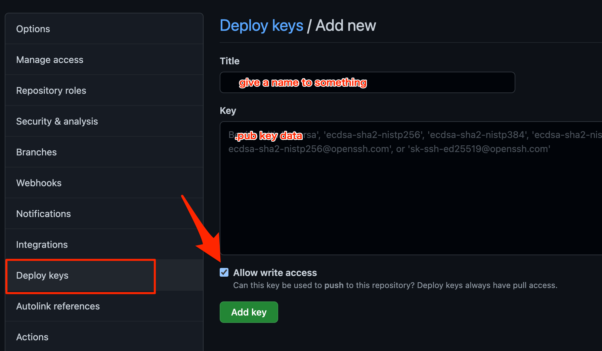
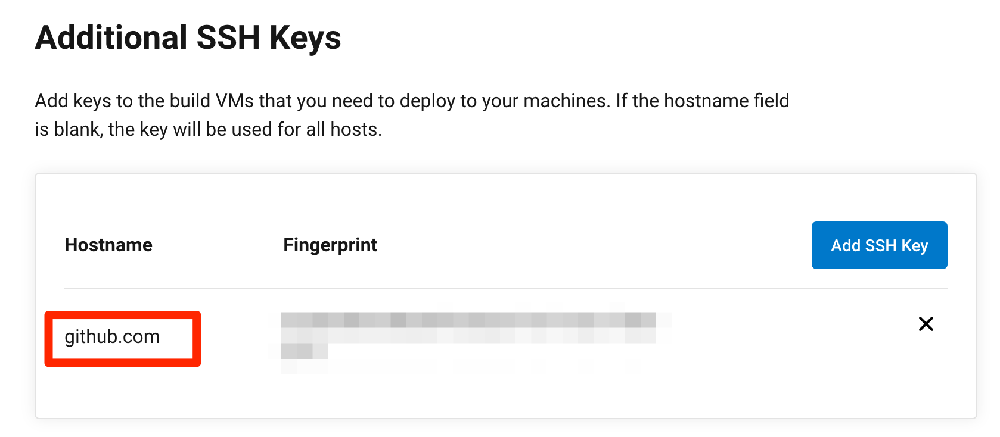

# Orbs-badges

## Easily generate and update ReadMe badges 


This orb creates a badge that looks like this:


This orb has the following functions.

- Immediately reflect the results of CircleCi jobs on the badge.
- You can instantly embed the latest badge you created in the ReadMe.
- If you embed `timedelta = X` in the URL described in the ReadMe, you can embed the time stamp in the badge.
- In addition to CircleCi's job status, you can also put your favorite character string (for example, version number).

## How to Use ?

### 1. Sign in to RHEMS BADGES

[RHEMS BADGES](https://badges.rhems-japan.com/)

Sign in using your github account.


### 2. Check `user id` and` api token`

The `user id` and` api token` are displayed.
- `api token`: Required when creating a badge.
- `user id`: Required for badge display.

It is recommended to set the api token as `BADGE_API_TOKEN` in the environment variable of the CircleCi project in advance.



### 3. Write the URL anywhere in the README

First, it's a good idea to run curl once to generate any badges.

The URL format of the image has the following structure.



|param|description|
|:---:|:---|
|`user id`|User ID obtained from "RHEMS badge"|
|`organization name`|Organization name. orb will automatically use the organization name of the repository in use if you are not doing anything|
|`repository name`|orb will automatically use the repository name in use if you haven't done anything in particular.|
|`app name`|The string on the left side of the badge.|
|`update date`|It is a time stamp automatically given by the application side.|
|`timedelta=X`|(option) If included, the badge will be given the time in the specified time zone.|

### 4. Prepare ssh key.

This orb has a function to rewrite README and `git push` in CircleCi job. Therefore, it is necessary to generate an ssh key with write permission in advance and register it in GitHub and CircleCi respectively.

#### 1. Create an ssh key

Use the `ssh keygen` command to generate a public / private key.

#### 2. Register your public key in the GitHub repository

- Open the `Setting` of your repository.
- Select `Deploy keys` from the menu on the left.
- Select `add deploy key`, copy and paste the contents of the public key (.pub) to Title with any name and Key.
- Check `Allow write access` and select `Add key`.



#### 3. Register your private key with your CircleCi project

- Open the `Project Settings` of your CircleCi project.
- Select `SSH Keys` from the menu on the left.
- Select `Add SSH Keys` under `Additional SSH Keys`.
- Paste all the contents of the private key you generated earlier into the Hostname, `github.com`, and the Private Key.
- Confirm that `Fingerprint` is displayed after registering the private key.



### 5. How to write `.circleci/config.yml`

Please specify the latest version of orb as much as possible.

```yml
  version: 2.1
  orbs:
    badges: rhems-japan/badges@x.y.z
```

Before calling this orb command, call the command to add the `ssh key` mentioned above. For `fingerprints`, enter the character string confirmed earlier.

The following is an example of using it from a command.

```yml
jobs:
  badges:
    docker:
      - image: cimg/base:stable
    steps:
      - checkout
      - add_ssh_keys:
          fingerprints:
            - "a0:b1:c2:d3:e4:f5:a6:b7:c8:d9:ea:fb:0c:1d:2e:3f"
      - badges/create_badge:
          organization: "my-organization"
          app: "my-app" # The string on the left side of the badge
          text: "v1.0" # The string on the right side of the badge
          color: "#ff0000" # (="red") Color of the right side of the badge
      - badges/update_readme

workflows:
  badge-update:
    - badges
```

The following is an example of using it from a job.

```yml
workflows:
  badge_jobs:
    jobs:
      - badges/create_badge:
          organization: "my-organization"
          app: "my-app" # The string on the left side of the badge
          text: "v1.0" # The string on the right side of the badge
          color: "#ff0000" # (="red") Color of the right side of the badge
      - badges/update_readme: # Execute checkout and add_ssh_keys in the job.
          fingerprint: "a0:b1:c2:d3:e4:f5:a6:b7:c8:d9:ea:fb:0c:1d:2e:3f"
```

## What if my badge doesn't update?

- Make sure that the organization name, app name, etc. in the URL are correct.
- If you create a badge without specifying color and txt, it will generate a badge with the string pass or error as the build status of CircleCi.
- If the CircleCi job fails with color and txt specified, the badge will not be updated; if the CircleCi job fails without color and txt specified, the badge will be updated with the string "error".
- If you call it as a job from a workflow, you can update the badge, but you cannot generate the badge by the job status in CircleCi.